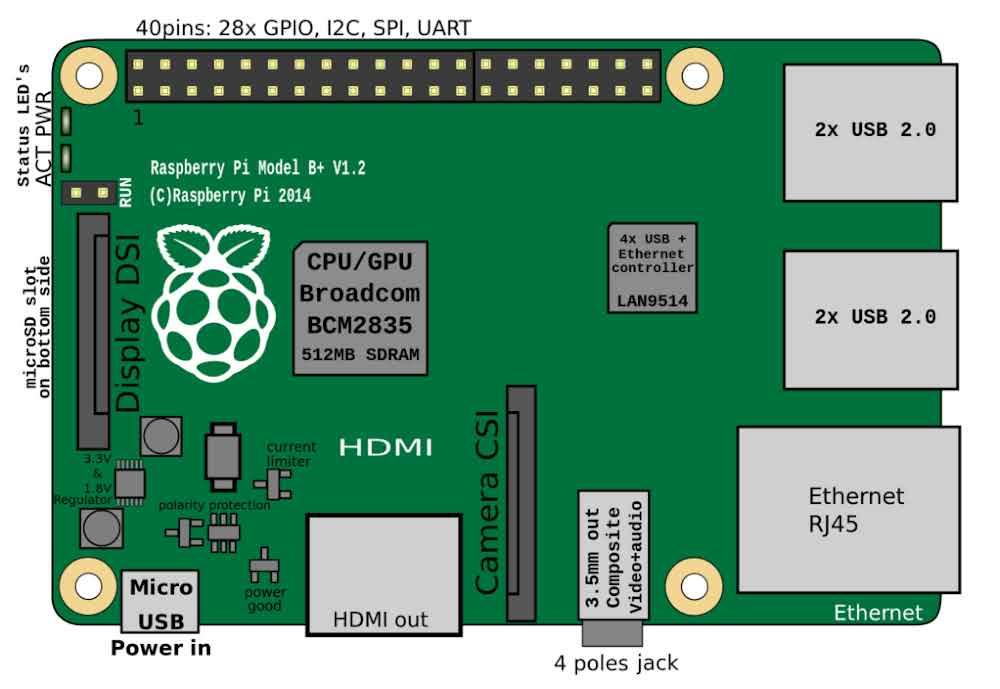

# Module 0: Introduction and Setting Up
In this section, we are going to introduce the Raspberry Pi Architecture and setting up your development environment. We will list resources, links, and images that may help you with your understanding. This is also for me as a developer learn more about how system architectures and firmwares are developed.

## Cross-Compilation
Many developers have different preferences on which OS they use. Many people use *MacOS*, *Windows*, or *Linux* Distros to develop their program. Cross Compilers help change each develop machine with different CPU architecture to be able to execute on a specific target, which in our case would be the Raspberry Pi 4B.

It is essential to know what architecture and peripherals you are working with in low-level programming. **Microcontrollers Units** (MCUs) in embedded systems have different inputs and outputs with no OS preinstalled. These may include a CPU, memory, and I/O peripherals. However, MCUs are typically using a single chip with a single-purpose that the developer will define for it. There will be limited resources in terms of memory. The advantage of this is the low-power consumption, real-time capabilities and small overhead with no OS installed. Some examples are STM32 Microcontrolelrs, MSP430, Arduinos, and etc.

In a **System-on-Chip** (SoC), it can be different since it integrates multiple CPU cores, GPU, memory controlelrs, interfaces, and other processing units. It would contain more external memory. These chips are more general-purpose for complex software with an OS. Many SoC chips will have multiple cores to leverage the out-of-order execution in parallel programming. This is an example of what a Raspberry Pi may look like:

**Bare-Metal Programming** uses techniques to help define the function for these components either for MCU or SoC architectures. Since we are using a SoC, we will be implementing the drivers for each peripheral which can be a difficult task in a complex system. I believe we can go through this together to learn more about how each behavior is functioning in a small yet intricate device.

Here are some of the information we can get about the Raspberry Pi 4B's [**BCM2711** SoC](assets/bcm2711-peripherals.pdf):
- Quad-core ARM Cortex-A72 CPU (64-bit)
- VideoCore VI GPU
- Memory controller (supporting up to 8GB LPDDR4)
- Various integrated peripherals (UART, SPI, I2C, etc.)
- High-speed interfaces (PCIe, USB 3.0, etc.)

