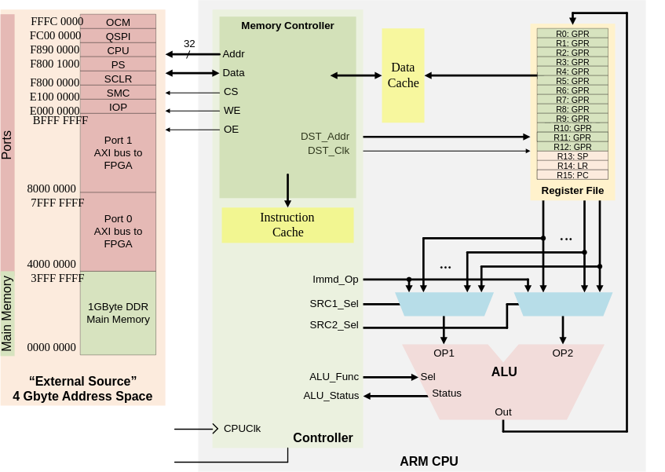
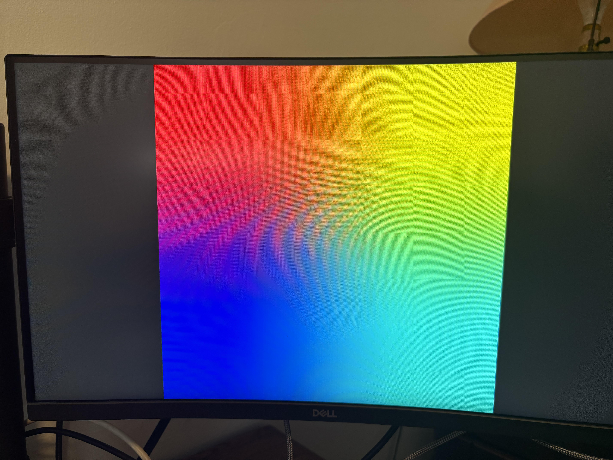

# Module 1: Bootstrapping
Bootstrapping refers to the process of initializing a computer system from a powered-off state to a point where it can execute user code. The term comes from the phrase "pulling yourself up by your bootstraps" suggesting the seemingly impossible task of a system starting itself before it's running.

## Stages of Bootstrapping
In computing, bootstrapping involves several stages:
1. **Initial Power-On** &rarr; Hardware circuits stablize
2. **ROM Execution** &rarr; A small, hardwired program begins execution
3. **Early Initialization** &rarr; Basic hardware components are configured
4. **Secondary Bootloader** &rarr; Loads and executes a more complex program 
5. **System Initialization** &rarr; Prepares the environment for application code
6. **Main Program Execution** &rarr; Transfers control to user code

## Boot Sequence on Raspberry Pi 4B (BCM2711)
The Raspberry Pi 4B boot process is different since it differs from traditional PC architecture, utilizing its GPU as part of the boot sequence.

1. **GPU Boot ROM** (First Stage Bootloader) - When power is applied the VideoCore GPU starts executing from its internal **Read-Only Memory** (ROM). The ROM code is initializing the essential GPU hardware. It checks for a bootable SD card and loads the second stage bootloader
2. **bootcode.bin** (Second Stage Bootloader) - These instructions are loaded by the ROM code and initializes the SDRAM and loads *start.elf*.
3. **start.elf** (GPU firmware) - This parses the *config.txt* for configuration parameters. Here's an example of what a configuration file may look like: 

    ```yaml
    # Enable audio
    dtparam=audio=on

    # Automatically load overlays for detected cameras
    camera_auto_detect=1

    # Automatically load overlays for detected DSI displays
    display_auto_detect=1

    # Enable DRM VC4 V3D driver
    dtoverlay=vc4-kms-v3d
    ```
    Afterwards, it loads the ARM executable (kernel.img or similar) into memory. Then it prepares the ARM processor for execution. 
4. **ARM Execution** - The GPU releases the ARM cores from reset and the execution begins at address `0x80000` for 64-bit mode. Here's what the ARM processor will do with the instructions:

    

## Directions to boot the Raspberry Pi 4B
1. After running the `make` command on your development machine, copy the file `kernel8.img` to the microSD card of the Raspberry Pi. Please use the imager tool that Raspberry Pi provides to get a clean install of Raspberry Pi OS.
2. Create a fresh install on the microSD card with a Lite Version of the OS.
3. Afterwards, you should see a bootfs directory when you plug it back into your computer (development machine). 
4. If `arm_64bit` is not set in the file `config.txt`, then set it by typing out `arm_64bit=1`. By setting this attribute to a non-zero value, the RPi will use the `kernel8.img` to boot and take advantage of the larger memory capacity.
5. Unmount the SD card and insert it into the SD Card slot on the Raspberry Pi and turn it on.

## Results
When powering up the RPi, you should be able to see a green LED and red LED. There should also be a flash of the "Rainbow Splash Screen" when you connect the screen to the Raspberry Pi then a black, blank screen. Since we haven't programmed the device to do anything. It should be a success! Congrats for finishing this first module!
Here's an example of what I got:

