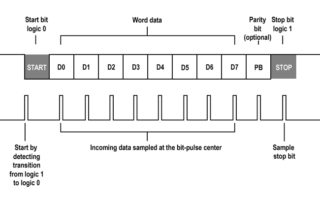
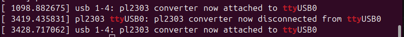
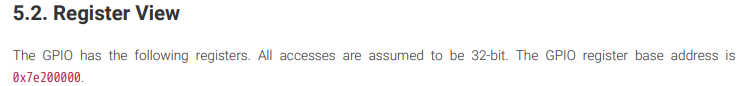
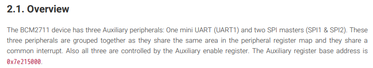

# Intro to UART
Universal Asynchronous Receiver/Transmitter (UART) is a popular serial communication protocol used for exchanging data between devices, often found in micro-controllers and other electronic components.

It uses two-wires to communicate with a "receiver" wire and a "transceiver" wire. Before USB, devices like mice, printers, and modems were connected using UART. In this section we will explore how UART communication ports work and how we can see the inputs and outputs.

## Properties of UART
- **Asynchronous Data Transfer**

    The advantage of using UART protocols is that it's asynchronous meaning, the transmitter and receiver do not share a common clock signal. However, since they do not share a clock, both ends of the communication must transmit and receive at the same bit timing or baud rate. The most common UART baud rates are `4800`, `9600`, `19200`, `57600`, & `115200` bps. 

- **Format of UART Packet**

    Here we can see the UART address format. The data frame in the packet can range from 5 to 9 bits. The **start bit** will always be 1 bit and there can be an optional **parity bit**. There will also be 1-2 bits for the **stop bits**.
    The parity bit tells the UART protocol the *evenness* or *oddness* of a number. This is to ensure the device receives the right amount of data. It checks if the number of enabled bits in the data frame is even or odd. If the parity bit is 0 (even parity), the number of enabled bits must also be even. If it is 1 (odd parity), then the number of enabled bits must be odd. Bits can be easily changed by electromagnetic radiation, mistmatched baud rates, or long-distance data transfer. This simple technique helps prevent errors in data packets.

    


## Connecting the serial cable
UART communication relies on timing and both ends need to have the exact speed of data being sent or received. When using PuTTY, we set the baud rate to `115200` and that means the RPi 4 needs to communicate at the rate too. We need the CPU core frequency to be fast enough to handle that.

Add this line to your `config.txt` to resolve this:
```C
core_freq_min=500
```

### Enabling COM Ports to view serial data
To enable the serial data viewing in Windows and Mac, you need to download the drivers for legacy COM Ports. The cable I used can be bought on [Amazon for $8.99](https://www.amazon.com/dp/B0BXDM3B2V?ref=ppx_yo2ov_dt_b_fed_asin_title) (USD in 2025). If you are on windows or Mac you can install the drivers using this [link](https://www.prolific.com.tw/us/ShowProduct.aspx?pcid=41&showlevel=0041-0041). If you use or have a different cable, please find the drivers from the manufacturer's website.

**NOTE**: For Mac, you may need to remove any previous driver before installing a newer one:
```
sudo rm -rf /System/Library/Extensions/ProlificUsbSerial.kext
```

#### Windows
For Windows user, download PuTTY to access the COM ports. However, check in Device Manager if your cable is connected. Then set the baud rate and device name.

#### Mac
After installing the driver, plug in the adapter and open a Terminal. Enter the command: `ls /dev/cu.*` and find something similar called `usbserial`. You need to find the right TTY device. Then you can either use `minicom` or `screen`.

#### Linux
I personally prefer using `minicom` to access the ports. Use this command to install minicom: `sudo apt-get install minicom`

To check where your device is located do: `sudo dmesg | grep tty` to see all kernel messages relating the to the *tty*. From there you should see something like this: 



To get an interactive window with minicom use: `minicom -s`

To exit do *Ctrl + A* and then *X* then confirm using *Y*. 

If you want to connect to the COM port in one line, you can do this:
`minicom -b 115200 -o -D /dev/ttyUSB0`

## Getting mini UART working
In order to implement UART, we need to write some functions in order to read the bits at the UART addresses. Here we have defined two functions to read and write the bits at the given address. 

```C
void mmio_write(long reg, unsigned int val) {
    *(volatile unsigned int *)reg = val;
}

unsiged int mmio_read(long reg) {
    return *(volatile unsigned int *)reg;
}
```

These functions are used to read and write from the memory-mapped io addresses. Please refer to the BCM2711 manual to see the address table on page 5 and page 8.

### Pre-Defined Addresses
In our functions we will reference many different addresses. It would be better to organize and set the names of the registers we intend to use. In Adam's file, he used an enum to set the values and name for each register. I'm used to using the `#define` macro to set the address of each register. There's seem to be a better way based on this [post](https://stackoverflow.com/questions/3970876/define-vs-enums-for-addressing-peripherals) on stack overflow but to each their own. There may be overhead for different interpretations but this is a small part of the bigger scope. 

We first set the Peripheral Address to `0xFE000000` since this is the default address when RPi 4 boots into *Low Peripheral Mode*. It maps the peripherals on the last 64 MB of RAM and visible to the ARM processor at `0x0_FExx_xxxx`. There is a *High-Peripheral Mode* that uses the full 35-bit address map but it requires some complex changes in the kernel to make it work. **Memory-mapped I/O**(MMIO) means the user can talk directly to the hardware by reading and writing to the predetermined memory addresses defined on the RPi4. The GPIO base address would start with an *offset* of `0x200000`. 



We also set the addresses for the UART buses based on the table in this section of the datasheet. We see that the Auxiliary peripherals start with an offset of `0x215000`. This can include mini UART(UART1) & two SPI masters (SPI1 & SPI2). They share a common interrupt and share the same area in peripheral register map.



An example of my implementation on defining the addresses:

```C
#define PERIPHERAL_BASE     0xFE000000
#define GPFSEL0             (PERIPHERAL_BASE + 0x200000)
#define GPSET0              (PERIPHERAL_BASE + 0x20001C)
#define GPCLR0              (PERIPHERAL_BASE + 0x200028)
#define GPPUPPDN0           (PERIPHERAL_BASE + 0x2000E4)
```

**Find `io.h` for more details and implementation.**

### GPIO Functions
In our code, we create the `gpio_call` to manipulate the value of the register with some value checking. This function is to abstract the complex bit manipulation required to configure GPIO pins to making the other gpio functions easier to implement.

```C
unsigned int gpio_call(unsigned int pin_number, unsigned int value, unsigned int base, unsigned int field_size, unsigned int field_max) {
    unsigned int field_mask = (1 << field_size) - 1;
  
    if (pin_number > field_max) return 0;
    if (value > field_mask) return 0; 

    unsigned int num_fields = 32 / field_size;
    unsigned int reg = base + ((pin_number / num_fields) * 4);
    unsigned int shift = (pin_number % num_fields) * field_size;

    unsigned int curval = mmio_read(reg);
    curval &= ~(field_mask << shift);
    curval |= value << shift;
    mmio_write(reg, curval);

    return 1;
}
```
**Find `io.c` to see the rest of the GPIO functions defined there.**

### UART functions
We created two functions for the kernel to call `uart_init()` and `uart_writeText()`. To initialize the UART, we would need to clear the bits of the registers for configuration (essentially resetting the UART). Then we set the functions of the GPIO pins that we connected from the Serial cable. *Note: In Adam's example, he uses pin 14, 15 Alt5 Function.* After we set the functions, we enable the transmitter and receiver:

```C
void uart_init() {
    mmio_write(AUX_ENABLES, 1); // Enable UART1
    mmio_write(AUX_MU_IER_REG, 0); // Disable interrupts
    mmio_write(AUX_MU_CNTL_REG, 0); // Disable transmitter and receiver
    mmio_write(AUX_MU_LCR_REG, 3); // Set 8 data bits
    mmio_write(AUX_MU_MCR_REG, 0); // Disable modem control
    mmio_write(AUX_MU_IIR_REG, 0xC6); // Disable interrupts
    mmio_write(AUX_MU_BAUD_REG, AUX_MU_BAUD(115200)); // Set baud rate

    gpio_useAlt5(14); // TXD1
    gpio_useAlt5(15); // RXD1

    mmio_write(AUX_MU_CNTL_REG, 3); // Enable transmitter and receiver
}
```


