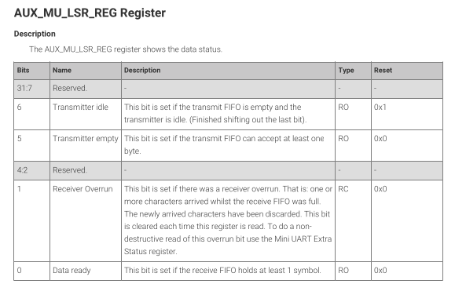

# UART FIFO Buffer
The UART FIFO buffer is essential for asynchronous inputs and outputs. Sometimes the operational speeds may be different or not supported. This can help create a smoother output.

## Data Type Structure
In this implementation, we use a **circular buffer** that utilizes a read and write index variable. This can save space in an embedded and limited resource environment. We can customize the max size of the buffer. 

To implement this, we use a `char` array with a set max value for this array. This will be located in the stack memory. The read and write will be first initialized to the beginning. Once you start writing data into the buffer.

```C
unsigned char uart_out[UART_MAX_QUEUE];     // UART output buffer
unsigned int uart_out_write = 0;            // Write index
unsigned int uart_out_read = 0;             // Read index
```

### Functions
To facilitate the input of the uart, we first store it in the queue buffer. As it accumulates into the buffer, we make sure that the read index and the write index don't interlap. This is to make sure that the right amount of data is read. If the read index passes the write index then the length of the buffer that is *occupied* is the **max size**. To update the UART, we created a function that is in an infinite loop.

```C
void uart_update() {
    uart_fifoToMem(); // Transfer data from the queue to the UART

    if (uart_readByteReady()) {
        unsigned char ch;
        uart_readFromMem(&ch); // Read from UART
        uart_fifoWrite(ch); // Write to the output queue
    }
}
```

The first method `uart_fifoToMem()` is to transfer the data on the queue buffer to the UART registers. This function writes until the register is full. The flag at the $6^{th}$ bit on the `AUX_MU_LSR_REG` indicates the status of the transfer FIFO that can send and receive the data. Here you can see the format of the bits for this register:



The second part of the function checks if the `AUX_MU_IO_REG` is ready to be read. Since only 8-bits can be transferred from this register we have to make sure that we are collecting the right data. This register is used to transmit and receive the data from UART.