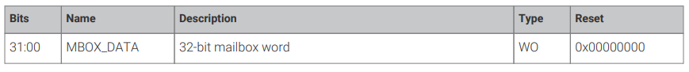

# Frame Buffer
The frame buffer is the region of memory that stores the data for the image that will be displayed on the screen. It's a *contiguous* block of memory that contains pixel data. Each pixel in the frame buffer corresponds to a location on the screen with the memory setup so that its row by row. The frame buffer on the Raspberry Pi 4B can support **16-bit** (RGB565), **24-bit**(RGB888), and **32-bit**(ARGB8888) color formats.

## Mailbox Protocol
To setup the frame buffer, we need the ARM processor to communicate with the GPU to allocate a frame buffer. To communicate with the GPU, the Raspberry Pi uses something called a **Mailbox Protocol**. Here's a good [resource link](https://jsandler18.github.io/extra/mailbox.html) that explains this well.

### ARM Mailboxes

The ARM mailboxes helps with communication between the ARM Cortex-A72 cores. There's around 16 mailboxes in total with each core having 4 of their own. The mailbox is a **32-bit wide register** where each bit can be set or cleared independently. The memory structure of these mailboxes are set like this:
- 16-bit write-set registers (MBOX_SET00 to MBOX_SET15)
- 16-bit write-clear registers (MBOX_CLR00 to MBOX_CLR15)

*NOTE: The write-clear registers can be read to check current state*

Each core occupies 4 mailboxes:
- Mailbox 0-3 --> Core 0
- Mailbox 4-7 --> Core 1
- Mailbox 8-11 --> Core 2
- Mailbox 12-15 --> Core 3

**NOTE: The ARM Mailboxes located in the ARM_LOCAL block are distinct from the VPU Mailboxes located in the ARMC block.**
 
Mailbox bits can be set by writing the appropriate `MBOX_SET` register. It will generate an interrupt when any of the bits are *non-zero*

The Mailbox's value can be *read* from the appropriate `MBOX_CLR` register. It can be *cleared* by writing to the corresponding `MBOX_CLR` register. It has read/write capabilities. (These registers are mostly used in the ARM core's intterupt handler).

### ARM Addressing
The Base address for the ARM Mailboxes start at `0x4c0000000`. This is for ARM only address and not a legacy master address. The **Low-Peripheral Mode** address is `0xff800000`.

#### MBOX_SET(00-16) Registers
The offset starts at `0x80` to `0xbc` for all Mailboxes. This is the structure of each mailbox register. We know that there are 16 mailboxes and 0-3 corresponds to the first core and so on.
Each mailbox can raise an interrupt to its core when any of the bits in this 32-bit word are set to '1'. 



### General Procedure
To read from the mailbox:
1. Read the status register until the empty flag is not set
2. Read data from the read register
3. If the lower four bits do not match the channel number desired then repeat from 1
4. The upper 28-bits are the returned data

To write to the mailbox:
1. Read the status register until the full flag is not set
2. Write the data (shifted into the upper 28-bits)

### VC Mailbox
Since the VideoCore Mailbox implementations are close-sourced and are not well documented, we need to interpret the information that is given and work off of that. In their [mailbox documentation](https://github.com/raspberrypi/firmware/wiki/Mailboxes), they describe the channels that controls the communication between the ARM CPU and VideoCore GPU. They also provide us with the registers and a page on how to *access* the mailbox [here](https://github.com/raspberrypi/firmware/wiki/Accessing-mailboxes). Although not documented well, we can work off what the manufacturer provides. 

The registers in this mailbox protocol uses a different addressing mode. The VideoCore section in Physical RAM is mapped in from `0x0_4000_0000` downwards. The size of the SDRAM for VC peripherals is determined in the `config.txt` and if the L2 Cache is enabled. The **MMU(Memory Management Unit)** translates the virtual memory addresses to physical memory addresses in the RPi. 

#### Mailbox Messages
The interface has 28-bits (MSB) available for the data and 4-bits (LSB) for the channel. This means when you send a request or receive the response the first 4-bits (LSB) will be the channel number and the rest will be the data value. 

#### Buffer Contents
In the buffer, we can include multiple tags to be processed in one operations. Typically, the tags are processed in order but for interfaces that requires multiple tags for a single operation like the frame buffer. The structure of the buffer should look like this:

```C
typedef struct {
    unsigned int buffer_size;   // Size of the entire buffer
                                // (include header values, end tag, and padding)
    unsigned int buffer_code;   // request/response code
    void *tags;                 // concatenated tags
    unsigned int end_tag = 0x0; // end tag of concatenated tags
    void *padding;              // to align the struct
} mbox_buffer
```

#### Tag Format
In the buffer, each concatenated tag will have a tag id, tag size, request/response code, the buffer, & padding to align the tag to 32 bits. This is what each tag should look like:

```C
typedef struct {
    unsigned int tag_id;    // tag identifier (ex. 0x00000001 for firmware revision)
    unsigned int tag_size;  // size of the tag includes 
                            // the id, code, buffer and padding in bytes
    unsigned int tag_code;  // request/response code
    void *tag_buf;          // values to input or output
    void *padding;          // to align the tag to 32-bits
} mbox_tag
```

**Note: These are not the implementation but merely a template of what it may look like.**

### 

