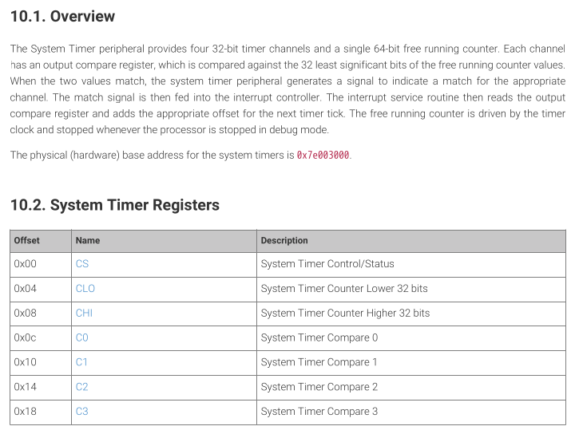

# Interrupts and Exception Handling
In this section, we will discuss more about Exception Handling and Interrupts. There will be faults and errors in any system but an efficient one will handle it without stopping its fundamental task. **Exceptions** are crucial part of building firmware. According to ARM, an exception is any event that disrupts the normal flow of program execution. This would require the processor to suspend the current task to execute an interrupt/exception handler. This will jump to the instructions that will handle what happens. Afterwards, it will return to the normal program execution. An example of this can be undefined commands in the instructions or an error detected during an operation.  An **interrupt** is a type of *external* exception that occur when there are independent events. For example, whenever you plug in a device, this sends an **IRQ (Interrupt Request)** to the processor asking for attention.

## Exception Levels
To help understand what these are, we can use an analogy. In a company, we have different roles like the HR manager, the CEO, the workers, etc. We can think of **Exception Levels** as the floors of the building and its roles. The higher you go, the more permissions you get. *EL3* (Exception Level 3) has the highest security clearance and it controls the entire building. *EL2* can be the management floor where it can oversee the employees. *EL1* can be where the employees work and *EL0* would be the public access area. For more technical functions of the Exception Level, *EL0* are mostly for **user applications**, *EL1* are mostly for **operating Systems** & **Kernel Modules**, *EL2* are for hypervisors or virtualization of EL1 and EL0, and *EL3* are for secure monitors.

In the Raspberry Pi 4B, the default exception level would be *EL3* when it boots in. There's a default Raspberry Pi stub that brings the processor down from EL3 to EL2. However, we do not need EL2 to execute our task so we need to drop the exception level down to *EL1*. To do that we need to add a bit of code to the boot sequence code. In each level, they have their own stack pointer, saved program status, and exception link registers. The stack pointer is the location of the top of the stack memory in RAM. For example, `SP_EL0` is pointing the top of the stack in EL0 but `SP_EL1` points the a different part of the stack for Exception Level 1 execution. The saved program status is used to save the location of the instruction when an exception is taken to a certain level.

## Interrupts
Interrupts are essential for tasks that need immediate attention from the CPU such as hardware interaction, I/O operations, hardware timers, etc. The CPU executes your program instructions endlessly so when something happens how will it handle it? The interrupts will need to jump to some handler to take care of the event. The CPU will need to know where this program location is using an **interrupt vector table**. The vector table is an array of addresses which is indexed by the IRQ vector number. For example 

### GIC-400
The design for the Raspberry Pi routes the interrupt signal to the **GIC-400** (Generic Interrupt Controller) and the Legacy Interrupt Controllers. The GIC-400 is the primary interrupt controller and can be disabled by the device tree in the `config.txt` file using `enable_gic=0`. From the BCM2711 Peripheral Sheet, we can see that the output of the Legacy Interrupt Controller goes through the **GIC-400** controller to route to the appropriate ARM core. This primary contain many features such as prioritization, distributor, and a CPU interface for each core in the SoC.


#### Distributor
The distributor receives interrupts and pushes them through the highest priority pending interrupt to every CPU interface. You can configure it to control the CPU interface from which it routes the **SPIs**(Shared Peripheral Interrupts), **PPIs**(Private Peripheral Interrupts) & **SGI**(Software Generated Interrupts). It can enable or disable interrupts, set priorities, and router interrupts to specific CPU cores. Each interrupt needs to be enabled and will need a priority value and a target. The targets would be the CPU interfaces and in a multi-core environment we need to assign a processor for it to execute. However, we have it only set to core 0 since we are working in a single-core environment *for now*. Here is a diagram of the distributor register offsets:


#### CPU Interface
Each interface signals interrupts to the processor and receives acknowledge and *EOI (End of Interrupt)* access from that processor. The interface only signals the interrupts if it has sufficient priority. Prioritization is determined by the CPU interface's configuration and the active interrupts' priority. Each core has its own CPU interface and is responsible for interrupt completion signaling. 

#### General Procedure
1. The controller checks which interrupts are enabled. 
2. For every pending interrupt, the **Distributor** chooses a target processor.
3. The **Distributor** checks for the highest priority pending interrupt to each CPU interface.
4. The CPU interface determines if the interrupt has a high enough priority to assert the IRQ or FIQ request to signal the processor.
5. When the processor takes the exception, it reads the Interrupt Acknowledge register (`GICS_IAR`) to notify the controller that the processor sees the pending interrupt and needs which interrupt is asserting the line. This returns the highest priority pending interrupt id. It then changes the state of that interrupt from *pending* to *active*.
6. After the interrupt is handled, the processor writes to the End of Interrupt Register (`GICC_EOIR`). This will deactivate the interrupt and set its state to *inactive*.

### Timer Interrupts
To implement the System Timer, we first consult the BCM2711 ARM Peripheral Manual that gives us info on the registers. We can see that there's **four 32-bit timer channels** & **one 64-bit free running counter**. Each channel has a compare register to compare the 32 least significant bits of the free running counter. When the compare value and the counter value match, the timer will signal the interrupt controller to read the compare register and add the appropriate offset for the next timer tick.



After handling the timer interrupt, we need to clear the interrupt signal. To do that, we need to write to the System Timer Control Register. This clears the register since it's **W1C** (*Write  to Clear*). Afterwards, we write to the End of Interrupt Register to signal the controller that we are done. However, due to the introduction of the GIC in the fourth version of the Raspberry Pi, the timer interrupt is routed through the Legacy Interrupt Controller and needs to be enabled in the GIC-400 according to this [blog](https://forums.raspberrypi.com/viewtopic.php?t=356695). To do that, we need to enable the interrupt, set the priority, assign its target processor, and set the type of interrupt. 

We first find out the interrupt id for the system timers in the GIC architecture. According to the BCM2711 ARM Peripheral Manual, `Timer 0` is **ID \#0** in the VideoCore Interrupts: 


According to the diagram below, the VC interrupts are routed at the *SPI IDs of 96 - 159*. To enable the Timer 0, we need to set the bit associated to **SPI ID 96** in the `GICD_ISENABLER`: 


To set the priority, we set the the priority for the Timer 0 in the offset of 96 since that's the Timer 0 ID. For each **word**(*32-bit number*) in the register, there are 4 priority fields that holds the value for each corresponding SPI, PPI, & SGI. We need to find the offset from the beginning of the address range to where `SPI 96`'s priority field would be. To calculate that, we use this formula:

```C
uint32_t n = irq / 4; 
uint32_t offset = (irq % 4) * 8;
long priorityReg = GICD_PRIORITY + (4 * n); 
```

In the first line, we determine the address of the priority register we are using. In this register it's a 32-bit number and every byte is an offset for one SPI ID. After setting the priority, we set a target processor where the interrupt handler will be executed. We would use the register `GICD_ITARGETSR`. In my implementation so far, we haven't enabled multicore scheduling so we only need to target the first CPU. Lastly, we set the configuration of the interrupt. There are two options: `level-sensitive` or `edge-triggered`. **Level-Sensitive** interrupts asserts the irq line when a value reaches a level and stays asserted. It's cleared when the interrupt is not at the level or it's manually cleared in the register `GICD_ICACTIVER`. **Edge-Triggered** interrupts assert the irq line on a rising edge and remain pending until cleared by the peripheral or manually cleared.

### UART Interrupts
In my current implementation, we are using miniUART (**UART 1**) with a polling design. The problem with this implementation is that it blocks the CPU from doing other tasks. It is continuously checking for data and wastes CPU cycles and power. It's inefficient for the processor to be always listening to the UART. To fix this, we only enable the **TX** when we have data to send. This allows the processor to handle the event in real-time and perform other instructions without waiting. Another benefit is the set clock frequency for UART. MiniUART's baud rate is determined by the VPU's frequency which can fluctuate but PL011 UART has its own clock frequency and is more stable. Therefore, this can lead to less loss in data and can handle reliable transfers at high speeds.

To initialize the UART interrupts, we have to configure these features:
- Enable UART FIFO and set the trigger levels
- Set the Baud Rate
- Configure the GPIO pins and functions
- Enable the transmission, receive, and UART
- Configure GIC to route interrupts

Using the BCM2711 manual and the VideoCore diagram in the *Timer Interrupt* section, we can see that the VC Interrupt contains the **OR of all PL011 UART** at **ID \#57**. This means the GIC will know if the UART is asserting an interrupt but won't know which one. Underneath the diagram there's a description about figuring out which UART asserted the IRQ line: 


The `PACTL_CS` address is at `0x7E204E00` but for *low-peripheral mode* we would change it to `0xFE204E00`. To know which irq was fired we have to read the bit position for those. In our case, UART uses bit **16** through **20** according to the diagram. After finding the which UART line is asserted, we check the corresponding **UART MIS** register to see which interrupt is being called. For my use case, we have the Receive, Transmit, & Receive Timeout handlers.

The Transmit interrupt's role is to refill the transmit FIFO from the output buffer. When we display to the UART, we directly write to the Data Register (`UART_DR`). This puts the character into the hardware FIFO for the Transmission. However when the FIFO starts to fill, we need a routine that can refill it. The transmission interrupt fires once there's a **transition** from greater than the trigger level to less than or equal to the trigger level.

The Receive Interrupt is different since sometimes there are short bursts of characters and then there are long messages. The receive interrupt is when there's a **transition** from less than the trigger level to greater than or equal to the trigger level. However, not all inputs will be that quick. So there's an additional interrupt called the Receive Timeout interrupt that handles this. It is fired when there's characters in the FIFO and no new input has been detected by 32-bit number period (the time it takes to transfer a 32-bit number based on the baud rate). For now, we do not have any application that needs to input from UART so we will develop an echo which takes the input and transmits it back to the user/console.

## Notes
- When developing the interrupt controller, I realized that the some of the peripherals are first routed through the Legacy Interrupt Controller then to the GIC-400. To enable that, we had to write to the IRQ Registers close to the ARMC Registers.
- Remember that **GPIO32** doesn't mean pin number **32** on the raspberry pi. Refer to the pinout chart in the BCM2711 Peripheral Manual.

# Resources
- Added [ARM GIC-400 file](../resources/ARM_gic400_manual.pdf) that describes the overview of the Raspberry Pi 4B's GIC. It will contain additional information of the controller that's not in the GICv2 manual.
- Added [ARM GIC v2 Architecture](../resources/gicv2_arch.pdf) that discloses the ARM Generic Interrupt Controller design and functionality. It provides helpful information like INterrupt Handling, Register Bits, Programmer's Model, etc.
- Added [PL011 UART Manual](../resources/pl011_uart_manual.pdf) that includes the PL011 UART interrupt procedures, Programmer's Model, and the register descriptions.
