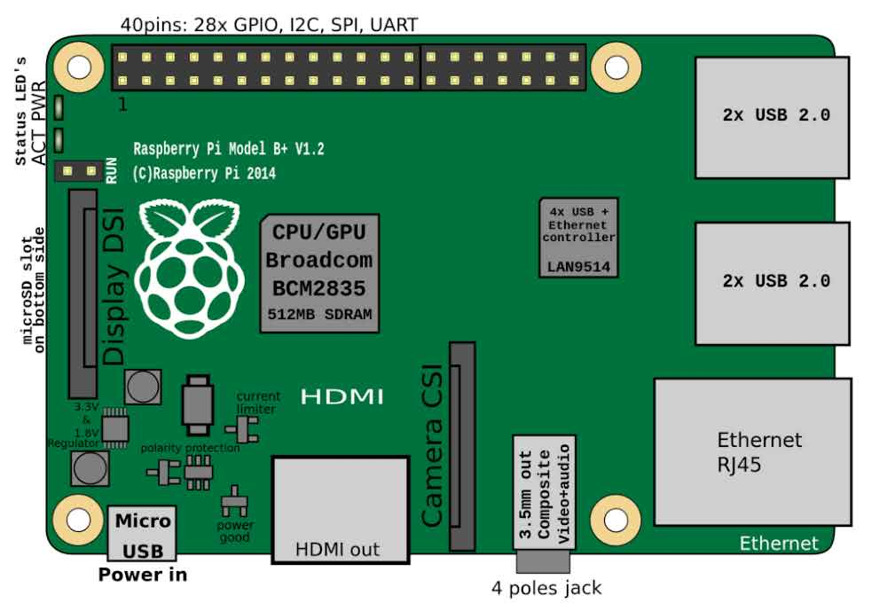

# Introduction
In this section, we are going to introduce the Raspberry Pi Architecture and setting up your development environment. We will list resources, links, and images that may help you with your understanding. Please make an issue ticket to provide feedback. Thank you!

## Cross-Compilation
Many developers have different preferences on which OS they use. Many people use *MacOS*, *Windows*, or *Linux* Distros to develop their program. Cross Compilers help each development machine with different CPU architecture to be able to execute on a specific target, which in our case would be the Raspberry Pi 4B.

It is essential to know what architecture and peripherals you are working with in low-level programming. **Microcontroller Units** (MCUs) in embedded systems have different inputs and outputs with no OS preinstalled. These may include a CPU, memory, and I/O peripherals. However, MCUs are typically using a single chip with a single-purpose that the developer will define for it. There will be limited resources in terms of memory. The advantage of this is the low-power consumption, real-time capabilities and small overhead with no OS installed. Some examples are STM32 Microcontrollers, MSP430, Arduinos, and etc.

In a **System-on-Chip** (SoC), it can be different since it integrates multiple CPU cores, GPU, memory controllers, interfaces, and other processing units. It would contain more external memory. These chips are more general-purpose for complex software with an OS. Many SoC chips will have multiple cores to leverage the out-of-order execution in parallel programming. This is an example of what a Raspberry Pi may look like:

**Bare-Metal Programming** uses techniques to help define the function for these components either for MCU or SoC architectures. Since we are using a SoC, we will be implementing the drivers for each peripheral which can be a difficult task in a complex system. I believe we can go through this together to learn more about how each behavior is functioning in a small yet intricate device.

Here are some of the information we can get about the Raspberry Pi 4B's [**BCM2711** SoC](Module_0/assets/bcm2711-peripherals.pdf):
- Quad-core ARM Cortex-A72 CPU (64-bit)
- VideoCore VI GPU
- Memory controller (supporting up to 8GB LPDDR4)
- Various integrated peripherals (UART, SPI, I2C, etc.)
- High-speed interfaces (PCIe, USB 3.0, etc.)

## Setting up
To setup the cross-compilation for your development machine, refer to this [link](https://developer.arm.com/downloads/-/arm-gnu-toolchain-downloads) to download the right version of the compiler. 

Please make sure you download the `aarch64 elf bare-metal target` version of the compiler. You should also download GNU make.

### Linux/WSL 
To install it, find the appropriate version for your computer. Afterwards, unzip the file using **tar**. Here's an example of using tar: `tar -xzvf [file-name].tar.gz`.

Once you unpack the compiler, you must add it to your `.bashrc` file. This file is automatically *sourced* and its contents are executed when you open a new interactive *bash* shell. This may be different when using a *login* shell. Here's a great [post](https://stackoverflow.com/questions/415403/whats-the-difference-between-bashrc-bash-profile-and-environment) talking about the shell.

### For MacOS (Apple Silicon & Intel)
I recommend using [Homebrew](https://docs.brew.sh/Installation) to install LLVM. Afterwards you can install it using this command: `brew install llvm`.

LLVM will give you all you need to start building for Raspberry Pi bare metal on Mac. I do not really have experience with Macbook Pro with Apple Silicon but [@babbleberry](https://github.com/babbleberry) does.
