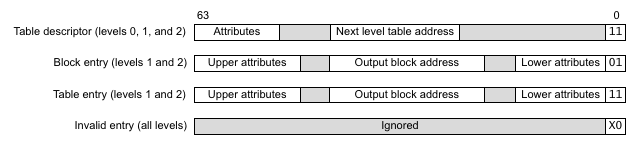

# Memory Management Unit
The Memory Management Unit (**MMU**) is a memory controller that assists in memory protection, cache policies, and virtualization of physical addresses. By enabling the MMU, the kernel can control which part of memory is cacheable, gaining significant performance in accessing data. The memory protection and virtualization allows the kernel to distinguish who has authority to access the specific part of memory. This can separate the kernel space and user space that is used in general operating systems. In this section of the development, we will enable the instruction and data cache and map the virtual address to physical address as a 1:1 map which means the virtual addresses will have the same addresses as physical addresses. The difference is we can describe that part of virtual address as *device* memory or *normal* memory.

## Translation Walks
The process of translating virtual address to physical address is called *translation walk*. The MMU would use multiple *page tables* to convert the virtual address from the code to the physical address the processor can use. A **page table** is a data structure that can contain *table descriptor*, *block entry*, or *page entry*:
- **Table Descriptor** - Contains the address to the next level in the translation walk.
- **Block Entry** - A section of the physical memory that is bigger than the *granule size*
- **Page Entry** - A p

We can also describe what type of memory that region is using *attributes*
