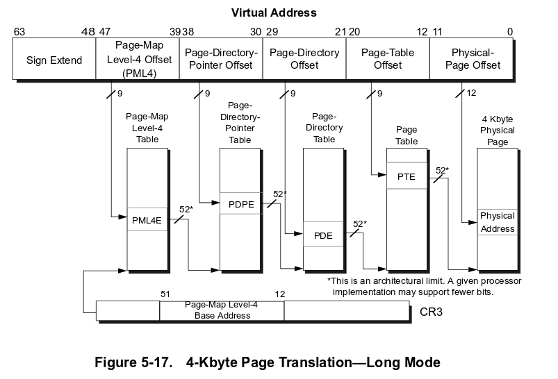

# Memory Management Unit
The Memory Management Unit (**MMU**) is a memory controller that assists in memory protection, cache policies, and virtualization of physical addresses. By enabling the MMU, the kernel can control which part of memory is cacheable, gaining significant performance in accessing data. The memory protection and virtualization allows the kernel to distinguish who has authority to access the specific part of memory. This can separate the kernel space and user space that is used in general operating systems. In this section of the development, we will enable the instruction and data cache and map the virtual address to physical address as a 1:1 map which means the virtual addresses will have the same addresses as physical addresses. The difference is we can describe that part of virtual address as *device* memory or *normal* memory.

## Translation Walks
The process of translating virtual address to physical address is called *translation walk*. The MMU would use multiple *page tables* to convert the virtual address from the code to the physical address the processor can use. A **page table** is a data structure that can contain *table descriptor*, *block entry*, or *page entry*:
- **Table Descriptor** - Contains the address to the next level in the translation walk.
- **Block Entry** - A section of the physical memory that is bigger than the *granule size*. The block address points to the memory while the attributes can describe who gets access to it.
- **Page Entry** - Similar to the block entry but the size is equal to the *granule size*.

In my implementation I used a **39-bit Virtual Address** because it is more simpler to implement, reduces overhead, and can map *512 GB* of space instead of the usual **48-bits Virtual Address**. The 48-bit virtual address can map to *256 TB* of memory if the *granule size* is **4KB**. We can work backwards from the granule size. To represent each address for each *4KB* page, we need *4096* different values and that requires **12-bits** ($2^{12}$). For the table that represents the 4KB pages, we need **512** entries because each entry will be a max size of *64-bits* or *8 bytes* and each page table must fit into a page which is **4KB**. Therefore, $4096 / 8 = 512$ and to represent 512 entires we need **9-bits** ($2^{9}$). 

Let's call the lowest table the **L3 Table**. If it has *512* entries representing *4KB* pages, it will map to *2MB* of memory. 

Let's call the next level **L2 Table** and each entry represents *2MB*. An entry can either be an **L3 Table** or a **Block Entry**. In my implementation, I only use *2MB* blocks of memory since it's simple to implement and we wouldn't need the *4KB* finer control. However, in the future we can add another layer of tables. With 512 entries in the **L2 Table**, we can represent $512 * 2MB = 1024 MB = 1 GB$. 

Now the same thing for the next level **L1 Table**. We know that an **L2 Table** represents **1GB** so therefore the **L1 Table** would represent **512 GB** ($512 * 1GB$). The next level would be **L0 Table** and that would represent **256 TB** ($512 * 512GB$). Since we didn't need that much to represent our memory map I decided to not have an *L0 Table*. 

If you are still confused on this, please use this diagram:

To store these page tables, we only need to store the highest level table. In this case we can store the address to the **L1 Table** to **TTBR0_EL1**. Any **invalid entry** will have the first two bits as *0b00*. When the MMU translates the address, it goes through each page table until it reaches a *block entry* or a *page entry* and therefore the *translation walk* is finished.

