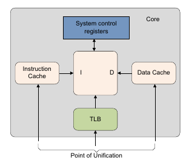

# Memory Management Unit
The Memory Management Unit (**MMU**) is a memory controller that assists in memory protection, cache policies, and virtualization of physical addresses. By enabling the MMU, the kernel can control which part of memory is cacheable, gaining significant performance in accessing data. The memory protection and virtualization allows the kernel to distinguish who has authority to access the specific part of memory. This can separate the kernel space and user space that is used in general operating systems. In this section of the development, we will enable the instruction and data cache and map the virtual address to physical address as a 1:1 map which means the virtual addresses will have the same addresses as physical addresses. The difference is we can describe that part of virtual address as *device* memory or *normal* memory.

## Translation Walks
The process of translating virtual address to physical address is called *translation walk*. The MMU would use multiple *page tables* to convert the virtual address from the code to the physical address the processor can use. A **page table** is a data structure that can contain *table descriptor*, *block entry*, or *page entry*:
- **Table Descriptor** - Contains the address to the next level in the translation walk.
- **Block Entry** - A section of the physical memory that is bigger than the *granule size*. The block address points to the memory while the attributes can describe who gets access to it.
- **Page Entry** - Similar to the block entry but the size is equal to the *granule size*.


In my implementation I used a **39-bit Virtual Address** because it is more simpler to implement, reduces overhead, and can map *512 GB* of space instead of the usual **48-bits Virtual Address**. The 48-bit virtual address can map to *256 TB* of memory if the *granule size* is **4KB**. We can work backwards from the granule size. To represent each address for each *4KB* page, we need *4096* different values and that requires **12-bits** ($2^{12}$). For the table that represents the 4KB pages, we need **512** entries because each entry will be a max size of *64-bits* or *8 bytes* and each page table must fit into a page which is **4KB**. Therefore, $4096 / 8 = 512$ and to represent 512 entires we need **9-bits** ($2^{9}$). 

Let's call the lowest table the **L3 Table**. If it has *512* entries representing *4KB* pages, it will map to *2MB* of memory. 

Let's call the next level **L2 Table** and each entry represents *2MB*. An entry can either be an **L3 Table** or a **Block Entry**. In my implementation, I only use *2MB* blocks of memory since it's simple to implement and we wouldn't need the *4KB* finer control. However, in the future we can add another layer of tables. With 512 entries in the **L2 Table**, we can represent $512 * 2MB = 1024 MB = 1 GB$. 

Now the same thing for the next level **L1 Table**. We know that an **L2 Table** represents **1GB** so therefore the **L1 Table** would represent **512 GB** ($512 * 1GB$). The next level would be **L0 Table** and that would represent **256 TB** ($512 * 512GB$). Since we didn't need that much to represent our memory map I decided to not have an *L0 Table*. 

If you are still confused on this, please use this diagram:


To store these page tables, we only need to store the highest level table. In this case we can store the address to the **L1 Table** to **TTBR0_EL1**. Any **invalid entry** will have the first two bits as *0b00*. When the MMU translates the address, it goes through each page table until it reaches a *block entry* or a *page entry* and therefore the *translation walk* is finished. 

## Cacheing 
Now that we have an understanding of the virtual addressing and how it's broken down, we can explain why and how the cache is used and why it's important to describe the memory regions. In the Raspberry Pi 4B with the ARMv8-A Architecture, it runs a **Modified Harvard Architecture** with separate L1 instruction and data caches. 
The *L1 cache* are the closest to the core which allows for fast access to data. However, the size is small due to minimization of latency. If the size is large, it is harder to search and consumes the die space in the CPU. Here is a diagram from the ARMv8-A Programmer's Guide



Cache maintenance definitions for cache coherency: 
- **Invalidation** - Cache must always be invalidated after reset as it contents are undefined. When the memory outside the cache changes, the cache needs to invalidate it to keep it coherent.

- **Clean** - "Dirty" cache lines, which are data that have been modified by the CPU, needs to be written back to memory keeping the data coherent throughout. Only applicable for data cache is which a write-back policy is used.

- **Zero** - Zeros a block of memory within the cache, without the need to read from the outer domain. Only applies to the data cache too.

### Instruction Cache (I-Cache)
The Instruction cache is a cache dedicated to fetching the CPU instructions. Since the cache is **fetch-only**, the cache will not have "dirty" lines and is only a **read-only** cache.  It's much easier to maintain and can only be **invalidated**. There is no hardware cache-coherency meaning any new code written to memory it can go through the Data Cache but I-Cache wouldn't see it. Therefore, we need to invalidate instructions to get the right cache data:

| Operation  | Description |
|----------- |-------------|
| `IC IALLUIS`  | Invalidate all, to Point of Unification, Inner Shareable |
| `IC IALLU`    | Invalidate all, to Point of Unification |
| `IC IVAU`     | Invalidate by Virtual Address to Point of Unification |

The most fundamental difference between the I-cache and D-cache:

| Aspect | I-Cache | D-Cache |
|--------|---------|---------|
| CPU Operations | **Fetch only** | Read and Write |
| Dirty Lines | Never (no writes) | Yes (modified data) |
| Write-back Required | No | Yes |
| Clean Operation | Not applicable | Required before invalidate |

Fetching instructions from the RAM can be expensive and using the Instruction Cache can reduce the latency. 

### Data Cache (D-Cache)
The Data Cache is used to improve memory access performance by storing frequently accessed data close to the processor core. Unlike the instruction cache, the D-Cache handles both **reads** and **writes**, introducing complexity around dirty data, coherency, and maintenance operations.

Here are some key terms:

| Term | Definition |
|------|------------|
| **Cache Line** | Smallest loadable unit. Contains contiguous words from memory. |
| **Set** | Collection of cache lines (one per way) that share the same index. |
| **Way** | A subdivision of the cache. Each way is indexed identically. |
| **Valid Bit** | Indicates whether the cache line contains usable data. |
| **Dirty Bit** | Indicates the cache line has been modified and differs from main memory. |

As data cache can be written back, there are different cache allocation policies to describe when a line should be allocated to the data cache and what happens when a store instruction is executed that hits in the data cache:
- **Write Allocation (WA)** - Cache line is allocated when a `store` instruction misses. **Note**: that even if we are writing 1 byte, WA will trigger the full cache line read first since cache operates on whole lines.
- **Read Allocation (RA)** - Cache line is allocated when a `load` instruction misses.
- **Write-Back (WB)** - When `store` instruction happens, it will update the cache but not update the memory by setting the *dirty* bit. The memory is updated later when the line is *evicted* with an explicit `clean` operation.
- **Write-Through (WT)** - When `store` instruction happens, it will update the cache and update the memory so that the line is *never* dirty.

With data cache having the ability to write to the cache lines, cache maintenance is very important to keep the correct data, especially when a region of memory is being shared with the GPU, DMA, or other cores. We use data barriers and synchronizations to keep cache coherency. That's when we can **clean** *dirty* cache line or **invalidate** the cache line.

| Operation | Description |
| --------- | ----------- |
| `DC CISW` | Clean and invalidate by Set/Way |
| `DC CIVAC`| Clean and Invalidate by Virtual Address to Point of Coherency|
| `DC CSW`  | Clean by Set/Way |
| `DC CVAC` | Clean by Virtual Address to Point of Coherency |
| `DC CVAU` | Clean by Virtual Address to Point of Unification|
| `DC ISW`  | Invalidate by Set/Way |
| `DC IVAC` | Invalidate by Virtual Address, to Point of Coherency |
| `DC ZVA`  | Cache Zero by Virtual Address |

### General Procedure
1. Setup Memory Attributes (nGnRnE - Normal WT, RA, WB, WA)
2. Setup Page Tables (L0 - L3 Tables)
3. Setting shareability, inner and outer cacheability, size offset, and granule size.
4. Set the TTBR0_EL1 address to the lowest level (ex. L0/L1 Table)
5. Cleaning & Invalidating the Data Cache.
6. Enable Data Cache, Instruction Cache, and MMU in SCTLR_EL1

## Memory Allocator
With this MMU, we can set a certain part of memory as our heap. In embedded systems, we can create a fixed-size memory allocator. Our options can be: 16B, 32B, 64B, 128B, 256B, 512B, 4KB and setting a limit on how many blocks are allocated for each option. 

In our implementation, we create a pool structure to contain the start and end address of each pool with a free linked list and the head of the metadata.

```C
// memory pool allocator structure
typedef struct {
    MemPoolSize block_size;
    uintptr_t start;
    uintptr_t end;
    metadata_t* free_list; // use to pop
    metadata_t* metadata; // use to store the head of the data
} pool_t;

// metadata for each block of memory
typedef struct metadata{
    uint8_t free;
    struct metadata* next;
} metadata_t;
```

To setup the allocator, we create the meta data and free linked list. After initializing, we can create the `malloc` and `free` function. To decide which pool we use, we can use the builtin compiler function `__builtin_clz`. We subtract the number of bytes by 1 to ensure that if the size is equal to the pool size, we can still determine the pool_size.

```C
if (nBytes == 0) {
    return NULL;
} else if (nBytes < POOL_16) {
    pool_size = POOL_16;
} else if (nBytes > POOL_512) {
    pool_size = POOL_4KB;
} else {
    pool_size = 1 << (32 - __builtin_clz(nBytes - 1));
}

// Loop through to find the memory pool
int pool_index = -1;
for (int i = 0; i < NUM_FIXED_SIZE; i++) {
    if (memory_pool[i].block_size >= pool_size) {
        pool_index = i;
    }
}
```

To **allocate** memory and find the next free block, we can just `pop` the next entry in the `free list` and set toggle the `free` bit, then return the address of that block.

To **free** the given entry, we can find the memory pool by comparing the range of the given address. Then toggle the `free` status again and add it back to the `free list` in the pool.

# Resources
1. ARMv8-A Programmer-Guide - A more detailed description and contains procedures of initializing certain parts of an ARMv8 Architectural System.


