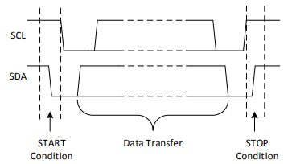
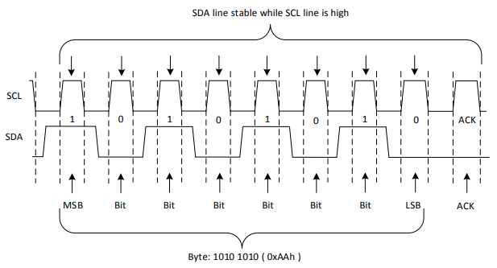
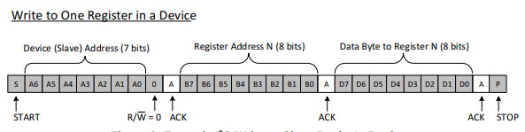
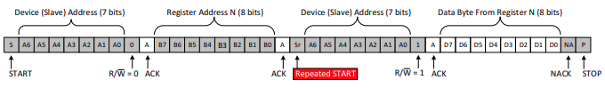

# I2C Drivers
The I2C or *Inter-integrated Circuit* is a fundamental communication protocol to learn and use in embedded systems. I2C is a serial, synchronous, half-duplex communication protocol that allows multiple masters and slaves on the same bus. To implement the I2C bus, we need two lines:
the **Serial Data Line** (SDA) and **Serial Clock** (SCL). Since I2C is cheap and simple to implement, many companies use this for low-speed communication devices. To be able to see this output, I bought a sensor that uses the I2C bus to communicate: **MLX90640 Thermal Camera**. 

## Master & Slave
Although the term is not PC (Politically Correct), the i2c bus contains two modes: **Master** & **Slave**. The master mode would initiate the data transfer and facilitate the clock signal and termination. The slave is a device that can communicate with the master. As you connect to the master, the slave drive would have its own device address to identify itself and can send and receive data. Each device has a specific device address to differentiate the other devices on the same i2c bus. The master must configure the slave device by accessing the slave's internal register maps. 

### General Procedures
1. Master wants to send data to a slave:
    - Master(TX) sends *START* condition and addresses the *slave*(RX)
    - Master sends data to slave
    - Master sends a terminating format with a *STOP* condition

2. Master wants to receive data from a slave:
    - Master(RX) sends a *START* condition and addresses the *slave*(TX)
    - Master sends the *register* it wants to read
    - Master receives data from the *slave*(TX)
    - Master sends terminating format with a *STOP* condition

Transfers can only be initiated when the bus is *idle*, which means both **SDA** and **SCL** lines are `HIGH` after a *STOP* condition is received.

### Data Format
To transfer a data bit in the i2c bus, the SCL clock pulse must be set HIGH. A byte contains 8 bits on the SDA line and it could contain the device address, register address, or the data itself from/to the slave.
Heres a format of what a data byte might look like:

Each byte of data needs to be followed by the Acknowledge bit for the slave to communicate that the byte was received successfully. When the receiver needs to send the ACK, the transmitter must first release the SDA line. To send an ACK bit, the receiver must pull down the SDA line when the clock period is during the `LOW` phase. 
Most data is written to or read from the slave registers, but some i2c devices may contain only 1 register that can be written directly to by sending the register data immediately after the slave address instead of providing the register address.

#### Write to Slave
To write on the bus, the master will send a START condition with the slave's address (7-bits) as well as the Read/Write Bit set to 0 for write. After the slave sends the ACK bit, the master will send register address it wishes to write to. After the slave sends another ACK bit for the register address, the master wil start sending the register data to the slave until the master has sent all data it needs to. Then the master will terminate the transmission with a STOP condition:
**Note**: The gray boxes mean the master controls the SDA line & the white boxes mean the slave controls the SDA line.

#### Read from Slave
To read from the slave on the i2c bus, the master will send the same two bytes similar to the write format until the third byte. The master would send another START condition with the slave address with the Read/Write bit set to 1 for read. After the slave acknowledges the bit, the slave will write into the SDA line with the data from the device register. After the master needs to acknowledge the bit, the master can send a STOP condition to end the transfer. 

# Testing the I2C
To test the i2c drivers, we will be using a MLX90640 Thermal Camera to stream onto the frame buffer. To do that, we need to implement the firmware the calculate the temperature. As the array is read from the memory of the sensor, the raspberry pi is responsible to calculate using the given Melexis Datasheet. 

# Resources

# Notes
